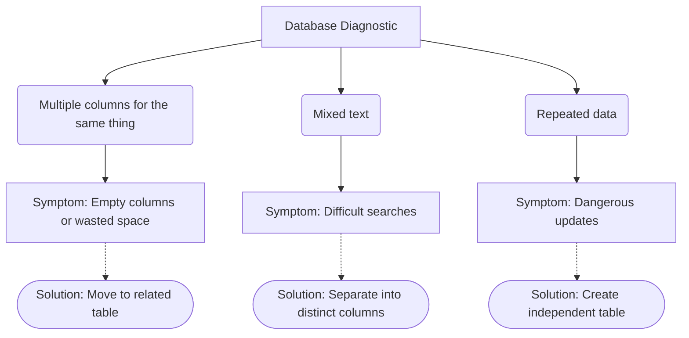

# How to Design a Good Database

Now that we know what tables and relationships are, how do we decide how to organize information? This section teaches practical rules to build a well-structured database.

## A Sick Database

To understand good design, we must first see what bad design looks like. Imagine you create a table called `CONTACTS` to store people's information.

At first glance, it might seem like a good idea to store everything in the same place. However, let's see what happens when we start filling it with real data.

| id | full_name | phone1 | phone2 | phone3 | email | residence_city | city_country_name |
|---|---|---|---|---|---|---|---|
| 1 | Ana Gómez | 300123 | | | ana@mail.com | Medellín | Medellín, Colombia |
| 2 | Juan Pérez | 310456 | 320789 | | juan@mail.com | Medellín | Medellín, Colombia |
| 3 | Luz Silva | 301987 | | 311234 | luz@mail.com | Bogotá | Bogotá, Colombia |
| 4 | Carlos Ruiz | 315654 | | | carlos@mail.com | Medellín | Medellín, Colombia |

:::warning[Detected Problems]
* **Problem 1: Repeated data (redundancy):** "Medellín" appears many times. If you discover a typo and it should be "Medellín Downtown", you would have to manually update hundreds or thousands of rows.
* **Problem 2: Meaningless empty columns:** `phone2` and `phone3` are empty for most people, wasting space and creating clutter.
* **Problem 3: One datum does two things:** `city_country_name` stores city and country simultaneously. If someone asks you to search for "only contacts from Colombia", it will be a headache.
* **Problem 4: Repeated groups:** `phone1`, `phone2`, and `phone3` are exactly the same type of information, just repeated as separate columns.
:::

We can visualize the symptoms of a sick database with the following diagnostic diagram:



## The Rules of Good Design

To prevent your database from getting sick, there are certain practical design rules. Below are four essential rules to keep your data organized.

### Rule 1: "One Data Point, Exactly Once"

Each piece of information must live in exactly ONE place within the database. If you find yourself repeating the same information across multiple rows, that data deserves its own table.

For example, if you have a city name repeated in every contact, it is better to create a separate table for cities.

:::tip[Before and After]
* **Before:** The contacts table has the `city_name` column repeated ("Medellín", "Medellín", "Medellín").
* **After:** You create a `CITY` table. The contact now only holds a `city_id` identifier.
:::

### Rule 2: "Each Column Holds ONE Thing"

A column must contain an indivisible piece of information. You should not mix different data types in a single cell.

:::tip[Before and After]
* **Before:** The `city_country_name` column holds the value "Medellín, Colombia".
* **After:** You split the information into two columns: `city` and `country`. Or better yet, create separate tables for both concepts.
:::

### Rule 3: "No More Columns of the Same Type"

If you have columns like `phone1`, `phone2`, `phone3`, you are breaking this rule. Whenever you have a group of columns doing the same thing, you must create a new table and link it.

**Before** — The same information repeated as separate columns:

| id | name | phone1 | phone2 | phone3 |
|----|--------|-----------|-----------|-----------|
| 1 | Ana | 300123 | 310456 | |
| 2 | Juan | 315789 | | |

**After** — A separate table with one row per phone number:

| id | person_id | number |
|----|------------|--------|
| 1 | 1 | 300123 |
| 2 | 1 | 310456 |
| 3 | 2 | 315789 |

:::tip[Advantage]
If Ana gets a fourth phone, you simply add one more row. You don't have to alter the table structure or touch Juan's data.
:::

### Rule 4: "Every Column Depends on the Key, Only the Key"

Every column in a table must tell us something about that table's primary key, not about other columns. All information must directly describe the table's main subject.

:::tip[Before and After]
* **Before:** In an `ORDER` table, you have `shipping_city`, `city_name`, and `city_zip_code`. The latter details describe the city, not the order.
* **After:** You keep the city identifier on the order, but create an `ADDRESS` or `CITY` table to store its details.
:::

## The Process of Improving a DB

Applying the rules requires a methodical process. Let's follow the steps using our sick `CONTACTS` table as a real example.

<StepByStep>
  <Step number={1} title="Write everything in a flat table">
    List absolutely all the information you need to store, without worrying about organization. Put it in a single giant table.

    *Applied to example:* We take the `CONTACTS` table with all its columns as-is:

    | id | full_name | phone1 | phone2 | phone3 | email | residence_city | city_country_name |
    |----|-----------------|-----------|-----------|-----------|--------|----------------------|---------------------|
    | 1 | Ana Gómez | 300123 | | | ana@ | Medellín | Medellín, Colombia |
    | 2 | Juan Pérez | 310456 | 320789 | | juan@ | Medellín | Medellín, Colombia |

    This is your starting "sick table". It is normal for it to look like this at first.
  </Step>
  <Step number={2} title="Find data repeated row by row">
    Look for columns whose values repeat across many rows. That indicates the data deserves its own table.

    *Applied to example:* The `residence_city` column has "Medellín" repeated in rows 1, 2, and 4. If we had 500 contacts from Medellín and the city changed its name, we'd have 500 rows to update by hand.

    **Action:** Create a separate `CITY` table and replace repeated text with a `city_id`.

    | id | city_name |
    |----|---------------|
    | 1 | Medellín |
    | 2 | Bogotá |
  </Step>
  <Step number={3} title="Split columns mixing two things">
    Look for columns that store more than one concept in a single cell. Separate them.

    *Applied to example:* The `city_country_name` column stores "Medellín, Colombia" — two data points in one. If someone asks to filter by country, it's impossible to do cleanly.

    **Action:** In the `CITY` table we created, split into two separate columns:

    | id | city_name | country_name |
    |----|---------------|-------------|
    | 1 | Medellín | Colombia |
    | 2 | Bogotá | Colombia |

    Now you can filter by country, by city, or by both effortlessly.
  </Step>
  <Step number={4} title="Remove groups of columns of the same type">
    If you have `phone1`, `phone2`, `phone3`... you are saving the same type of data in repeated columns. Create a separate table with one row per value.

    *Applied to example:* Instead of 3 phone columns, we create the `PHONE` table:

    | id | person_id | number |
    |----|------------|--------|
    | 1 | 1 | 300123 |
    | 2 | 2 | 310456 |
    | 3 | 2 | 320789 |

    Now Juan can have 10 phones and we will never run out of room. You just add rows, not columns.
  </Step>
  <Step number={5} title="Verify that each column describes only its table">
    Read each column and ask: "Does this datum describe the main entity or something else?". If the answer is "something else", move it.

    *Applied to example:* We inspect the `PERSON` table. Does `full_name` describe the person? Yes. Does `email` describe the person? Yes. Does `city_country_name` describe the person or the city? The city — we already moved it in Step 3.

    **Action:** Split `full_name` into `first_name` and `last_name` for extra flexibility:

    | id | first_name | last_name | email | city_id |
    |----|--------|----------|-------------|-----------|
    | 1 | Ana | Gómez | ana@mail.com | 1 |
    | 2 | Juan | Pérez | juan@mail.com| 1 |
  </Step>
  <Step number={6} title="Draw the final diagram">
    With all tables cleaned up, build the ER diagram to visualize how they connected. This is the design you will implement in code.

    *Applied to example:* The final result of redesigning `CONTACTS` is:

    ```mermaid
    %%{init: {
        "theme": "base",
        "themeVariables": {
            "primaryColor": "#bed1fa",
            "primaryTextColor": "#000000",
            "lineColor": "#bed1fa"
        }
    }}%%
    erDiagram
        CITY {
            int id PK
            string city_name
            string country_name
        }
        PERSON {
            int id PK
            string first_name
            string last_name
            string email
            int city_id FK
        }
        PHONE {
            int id PK
            int person_id FK
            string number
        }
        CITY ||--o{ PERSON : "has residents"
        PERSON ||--o{ PHONE : "has numbers"
    ```

    We moved from a chaotic table with 8 columns to three clean tables, with no repeated data and no empty columns.
  </Step>
</StepByStep>

## Test Your Knowledge

<Quiz id="dedw-db-design-quiz">
  <Question title="Which rule primarily solves the problem of redundancy and repeated data?">
    <Option>The rule that each column holds a single thing.</Option>
    <Option correct>The rule of one data point, exactly once.</Option>
    <Option>The rule of no more columns of the same type.</Option>
    <Option>The rule of grouping similar data.</Option>
  </Question>

  <Question title="If you have columns phone1, phone2, and phone3, what should you do?">
    <Option>Leave them as-is to make the database faster.</Option>
    <Option>Add phone4 just in case they need it later.</Option>
    <Option correct>Create a new table for phones and link it.</Option>
    <Option>Combine all numbers separated by commas into a single column.</Option>
  </Question>

  <Question title="What does a column that mixes two different values need (e.g. first and last name)?">
    <Option>Change data type so both fit.</Option>
    <Option>Create a bridge table to connect them.</Option>
    <Option>Leave as-is because it saves space.</Option>
    <Option correct>Split into independent columns for each value.</Option>
  </Question>

  <Question title="What is a junction or bridge table used for?">
    <Option correct>To connect two tables in a many-to-many relationship.</Option>
    <Option>To store backup copies of repeated data.</Option>
    <Option>To store empty columns.</Option>
    <Option>To replace primary keys.</Option>
  </Question>

  <Question title="When should you move data to its own independent table?">
    <Option>When a table exceeds 10 columns.</Option>
    <Option>Only when the client explicitly asks for it.</Option>
    <Option correct>When you discover that the same data will repeat across multiple rows.</Option>
    <Option>When text strings are too long to read.</Option>
  </Question>

  <Question title="What is the main problem if a city name is repeated textually in 500 rows?">
    <Option>The database will stop working due to lack of memory.</Option>
    <Option correct>If the name changes or has a typo, you have to update 500 different places.</Option>
    <Option>Phone numbers will get mixed up with text.</Option>
    <Option>No problem at all, databases are built for that.</Option>
  </Question>

  <Question title="What does it mean in simple words that 'every column depends on the key'?">
    <Option>If you delete the key, columns are not deleted.</Option>
    <Option>Columns need a password to be viewed.</Option>
    <Option>All tables must have foreign keys.</Option>
    <Option correct>The row data must describe the main subject of the table and nothing else.</Option>
  </Question>

  <Question title="If a BOOK table has columns: id, title, author, author_birth_date. What is the design error?">
    <Option>The title should be in a separate table.</Option>
    <Option>It is missing a bridge table to connect id with title.</Option>
    <Option correct>The birth date describes the author, not the book, and should be in an authors table.</Option>
    <Option>Books do not need an id field.</Option>
  </Question>
</Quiz>
