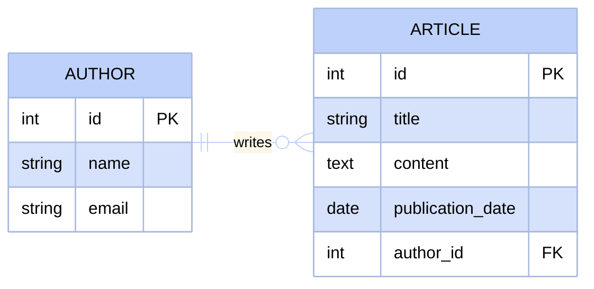
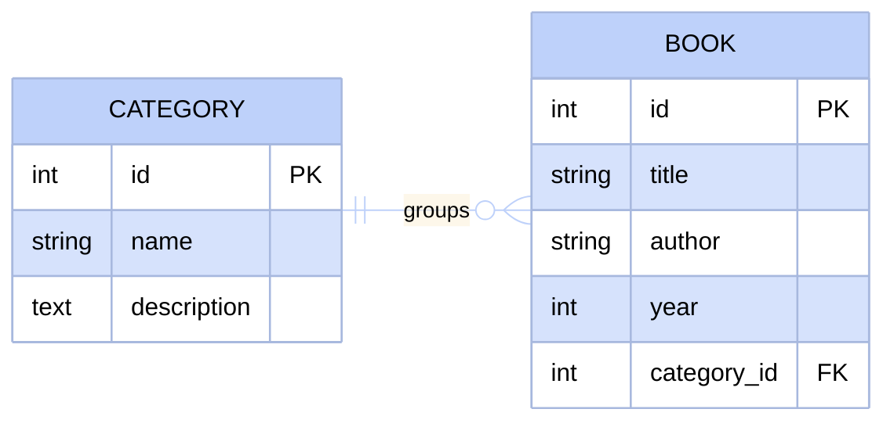
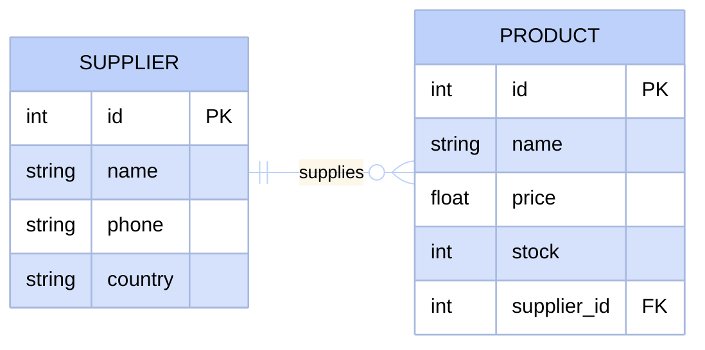
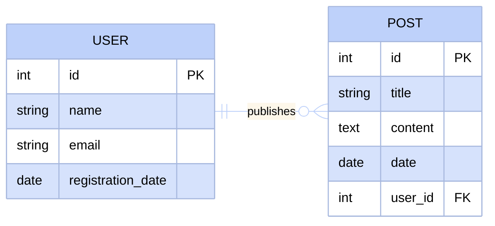
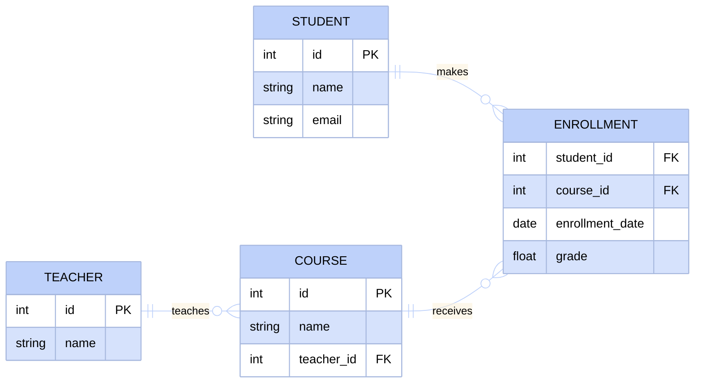
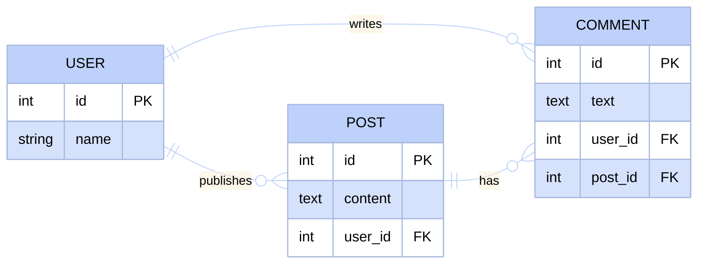
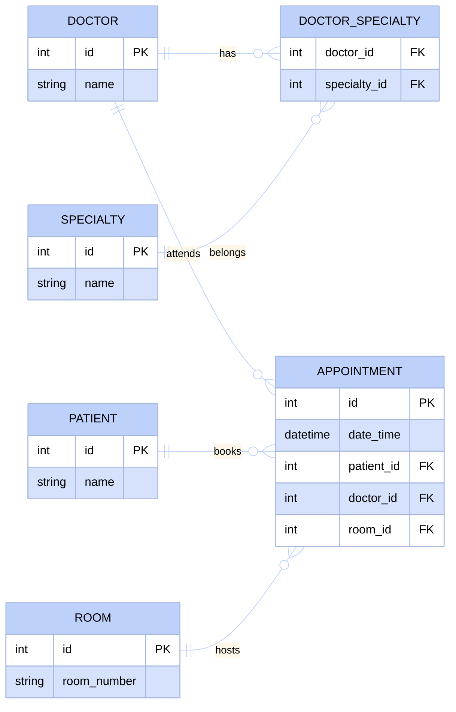
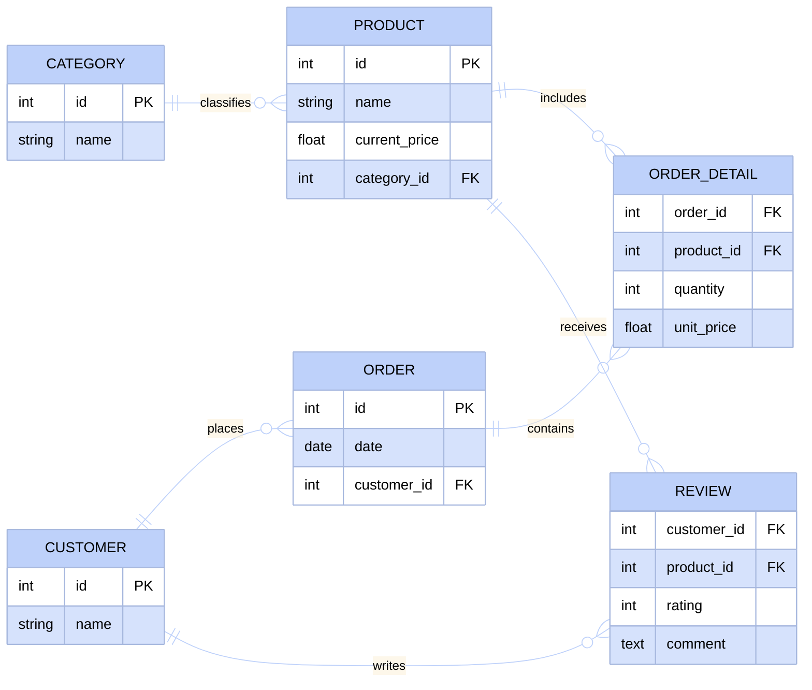
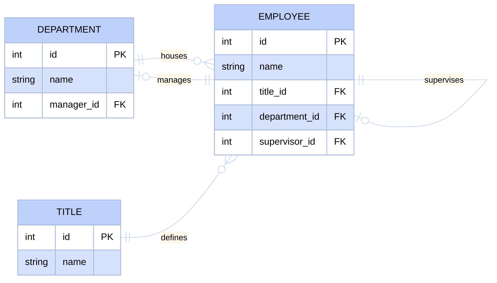
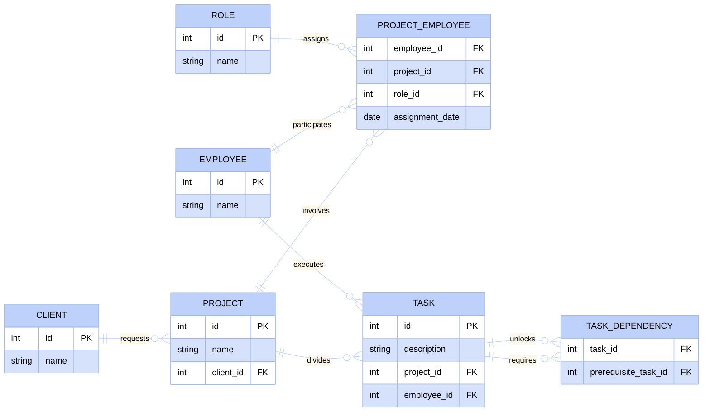

# Exercises: From Text to Diagram

The best way to learn database design is by practicing going from a problem description to a diagram.

These exercises progressively increase in complexity.

Before solving each one, try to identify the fundamental parts of the problem.

:::tip[Before drawing the diagram, ask yourself]
- What things (entities) appear in the text?
- What information do I have for each (attributes)?
- How do they relate to each other?
- How many of A can relate to how many of B? (1:1, 1:N, N:M)
- Do I need a junction table for any N:M relationship?
:::

### Exercise 1: Simple Blog
**Level: Beginner**

A blog has authors who write articles. Each article belongs to a single author.

:::info[Hint]
Think about the main entity creating content and the entity representing that content. Where should you place the foreign key to connect both?
:::

View proposed solution

In this diagram we see a classic one-to-many relationship. The author exists independently and the article depends on the author.

### Exercise 2: Basic Library
**Level: Beginner**

A library organizes its books by categories. Each book belongs to a single category, but a category can have many books.

:::info[Hint]
Identify which entity serves as a grouping or classification for the other. The grouping entity usually lends its identifier to the classified items.
:::

View proposed solution

Here the category acts as a catalog. We store the category identifier inside each book to know where it belongs.

### Exercise 3: Store with Products and Suppliers
**Level: Basic**

A store sells products. Each product has a supplier supplying it. A supplier can supply several products, but each product has a single main supplier.

:::info[Hint]
Consider contact details you might need from the supplier and inventory details for the product. Cardinality determines where we store the reference.
:::

View proposed solution

Since a product has only one main supplier, it is safe to put the supplier identifier inside the product table.

### Exercise 4: Simple Social Network
**Level: Basic**

In a social network, users publish posts. Each post is written by a single user. Posts have a title, content, and publication date.

:::info[Hint]
Similar to the blog exercise, but with social network-specific attributes. Think about user-specific information to collect.
:::

View proposed solution

The fundamental structure remains one-to-many. The user identifier is placed in the post to represent ownership.

### Exercise 5: Course System
**Level: Intermediate**

In an educational platform, teachers teach courses. Students enroll in courses. Each course has a single assigned teacher, but a student can enroll in multiple courses and a course can have multiple students.

:::info[Hint]
The relationship between teachers and courses is direct, but between students and courses it is many-to-many. What junction table do you need to handle enrollment?
:::

:::warning
Do not attempt to store a list of courses inside the student, nor a list of students inside the course. Remember that relational databases require bridge tables.
:::

View proposed solution

The enrollments table acts as a bridge. It also allows us to save data like grades, which only make sense within that specific relationship context.

### Exercise 6: Social Network with Comments
**Level: Intermediate**

Users on a social network create posts and can comment on any post (including their own). Each comment belongs to a specific post and was written by a specific user.

:::info[Hint]
A comment is an entity depending on two others simultaneously. Think about how many foreign keys the table will need to avoid losing information.
:::

View proposed solution

The comments entity must reference both its author and the original post where it was published.

### Exercise 7: Hospital System
**Level: Advanced**

A hospital has patients seen by doctors in specific rooms. Each appointment involves exactly one patient, one doctor, and one room. A doctor can have multiple specialties.

:::info[Hint]
The relationship between doctors and specialties is many-to-many. On the other hand, the appointment is the heart of the system connecting three separate entities.
:::

View proposed solution

Notice how the appointment centralizes the model by containing three foreign keys simultaneously. Medical specialties are also isolated.

### Exercise 8: Online Store with Reviews
**Level: Advanced**

An online store organizes products into categories. Customers place orders containing several products in varying quantities. Furthermore, customers can write reviews for purchased products, providing a score and comment.

:::info[Hint]
There are two many-to-many relationships here. An order breaks down into line items to store quantities. Reviews are a separate relationship between customer and product.
:::

View proposed solution

It is crucial to save the unit price in order detail. Product prices can change over time, but the order must record the exact amount at purchase time.

### Exercise 9: Company with Employees and Departments
**Level: Expert**

A company has employees working in departments. Each department has a manager (who is also an employee). An employee belongs to a single department and has a single job title assigned. Employees can have a direct supervisor (who is also an employee in the same system).

:::info[Hint]
This exercise requires self-references and catalog normalization. How do you make an employee point to another employee? The department also needs to point to the employee table, and job titles should be in their own catalog table.
:::

View proposed solution

The employee table uses a self-referencing foreign key to record the supervisor, references `TITLE` for their position, and department references employee to assign its manager.

### Exercise 10: Project Management System
**Level: Expert**

In a software company, employees work on multiple projects assuming different roles (Tech Lead, Frontend Dev, QA, etc.). Each project belongs to a client. Projects break down into tasks assigned to employees. Some tasks can only start when others have been completed (dependencies).

:::info[Hint]
This is the final challenge. Break down the problem: clients and projects, employees on projects with roles (using a catalog table for roles), assigned tasks, and finally task dependencies.
:::

View proposed solution

This model handles multiple assignments with cataloged roles, task tracking, and complex dependencies using a self-referencing junction table.

:::info[Conclusion]
If you reached Exercise 10, you now have the tools to design the database for almost any real-world application.
:::
