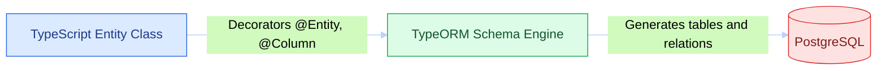
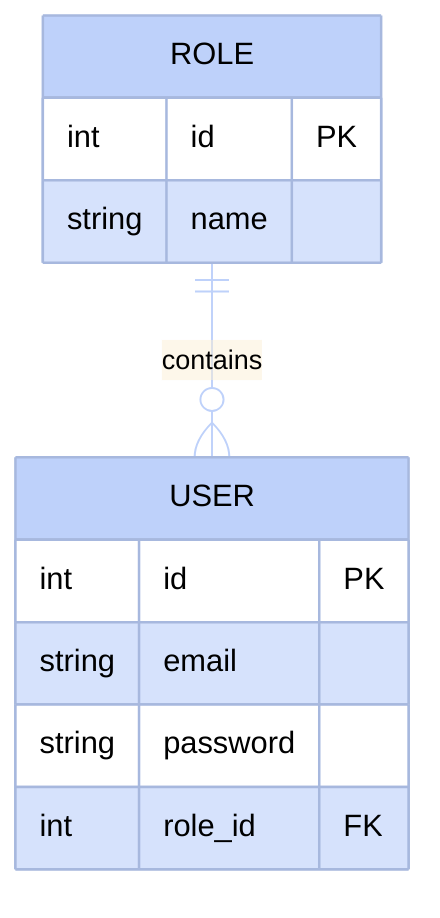

# Entities in NestJS with TypeORM

Now that we know how to design a relational database (tables, relationships, foreign keys), it is time to implement it in code. TypeORM is the bridge between our NestJS code and PostgreSQL. This section shows how to translate entity-relationship diagrams into decorated TypeScript classes defining the system structure.

## What is TypeORM and Why Do We Need It?

TypeORM is an Object-Relational Mapper (ORM), a tool translating between TypeScript classes (objects) and database tables (relations). 
- Without TypeORM, we would have to write raw SQL queries (`CREATE TABLE...`, `ALTER TABLE...`) and handle types manually.
- With TypeORM, we define **Entity** classes and decorators. TypeORM automatically creates tables, defines columns, primary keys, constraints, and relationships.



## From ER Diagram to Code: How It Translates

Let's take as an example the relationship between `USER` and `ROLE`. In our design, a role can belong to multiple users, and a user has a single role (one-to-many relationship).



The following table summarizes how graphical elements in the diagram convert into TypeORM decorators:

| In Diagram | In TypeORM (TypeScript) | Common Options |
|---|---|---|
| Entity (table) | `@Entity('table_name')` | `{ name: 'users' }` |
| Autoincrement Primary Key | `@PrimaryGeneratedColumn()` | `'increment'`, `'uuid'` |
| Attribute / Column | `@Column()` | `{ unique: true, nullable: false, length: 100 }` |
| 1:N Relationship (One-to-Many) | `@OneToMany(() => Target, (target) => target.property)` | On principal entity (e.g. `Role`) |
| N:1 Relationship (Many-to-One) | `@ManyToOne(() => Target, (target) => target.property)` | On entity with FK (e.g. `User`) |
| Explicit Foreign Key | `@JoinColumn({ name: 'col_name' })` | Defines exact physical FK column name in DB |

---

## Practical Setup & Entity Creation Guide

<StepByStep>

<Step>
### Dependencies Installation

Install the required TypeORM packages and PostgreSQL driver in your NestJS project:

```bash
npm install --save @nestjs/typeorm typeorm @nestjs/config pg
```
</Step>

<Step>
### Environment Variables Setup (`.env`)

Create the `.env` file at the project root. This file serves both for NestJS application configuration and for parameterizing the Docker Compose container:

```env title=".env" showLineNumbers
# Database Configuration
DB_HOST=localhost
DB_PORT=5437
DB_USERNAME=postgres
DB_PASSWORD=postgres
DB_DATABASE=nest_db
```
</Step>

<Step>
### PostgreSQL Docker Setup (`docker-compose.yml`)

Create the Docker Compose configuration using PostgreSQL **v18** parameterized via `.env` environment variables:

```yaml title="docker-compose.yml" showLineNumbers
services:
  db:
    image: postgres:18
    restart: always
    environment:
      POSTGRES_USER: ${DB_USERNAME}
      POSTGRES_PASSWORD: ${DB_PASSWORD}
      POSTGRES_DB: ${DB_DATABASE}
    ports:
      - '${DB_PORT}:5432'
    volumes:
      - postgres-data:/var/lib/postgresql/data

volumes:
  postgres-data:
```

To start the database container run:

```bash
docker compose up -d
```
</Step>

<Step>
### TypeORM Setup in AppModule

Connect NestJS with PostgreSQL dynamically reading variables from `.env`:

```typescript title="src/app.module.ts" showLineNumbers
import { Module } from '@nestjs/common';
import { TypeOrmModule } from '@nestjs/typeorm';
import { ConfigModule, ConfigService } from '@nestjs/config';

@Module({
  imports: [
    ConfigModule.forRoot({
      isGlobal: true,
    }),
    TypeOrmModule.forRootAsync({
      imports: [ConfigModule],
      inject: [ConfigService],
      useFactory: (configService: ConfigService) => ({
        type: 'postgres',
        host: configService.get<string>('DB_HOST'),
        port: configService.get<number>('DB_PORT'),
        username: configService.get<string>('DB_USERNAME'),
        password: configService.get<string>('DB_PASSWORD'),
        database: configService.get<string>('DB_DATABASE'),
        entities: [__dirname + '/**/*.entity{.ts,.js}'],
        synchronize: true, // Automatically syncs entity schema in development
      }),
    }),
  ],
})
export class AppModule {}
```
</Step>

<Step>
### Deep Dive into Decorators and Entity Attributes

Below we explore fundamental options passed to TypeORM decorators:

#### 1. `@Entity(name?: string, options?: EntityOptions)`
Defines that the class represents a table. If a name is omitted, the lowercase class name is used.
```typescript
@Entity('roles') // Explicit table name in PostgreSQL
```

#### 2. `@PrimaryGeneratedColumn(strategy?: string)`
Sets the primary key for the entity.
* `'increment'`: Autoincrementing integer key (default).
* `'uuid'`: Universal unique identifier (useful for distributed systems and higher security).

#### 3. `@Column(options?: ColumnOptions)`
Configures exact column properties in PostgreSQL:
* `type`: SQL data type (`'varchar'`, `'int'`, `'boolean'`, `'text'`, `'timestamp'`, etc.).
* `unique`: `true` forces the value to be unique across the entire table.
* `nullable`: `true` allows null values (`NULL`). Default is `false`.
* `default`: Sets a default value if none is provided.
* `length`: Sets maximum length for `varchar`.

```typescript
@Column({ type: 'varchar', length: 150, unique: true, nullable: false })
email: string;

@Column({ type: 'boolean', default: true })
isActive: boolean;
```

#### 4. Relationships: `@OneToMany`, `@ManyToOne`, and `@JoinColumn`
* `@OneToMany(() => TargetEntity, (instance) => instance.relatedProperty)`: Defined on the "One" side. Returns an array of child entities.
* `@ManyToOne(() => TargetEntity, (instance) => instance.relatedProperty)`: Defined on the "Many" side (the entity holding the Foreign Key).
* `@JoinColumn({ name: 'fk_column_name' })`: Optional but very useful to specify the exact physical FK column name in DB.

```typescript title="src/roles/entities/role.entity.ts" showLineNumbers
import { Entity, PrimaryGeneratedColumn, Column, OneToMany } from 'typeorm';
import { User } from '../../users/entities/user.entity';

@Entity('roles')
export class Role {
  @PrimaryGeneratedColumn()
  id: number;

  @Column({ type: 'varchar', length: 50, unique: true })
  name: string;

  // A role relates to many users
  @OneToMany(() => User, (user) => user.role)
  users: User[];
}
```

```typescript title="src/users/entities/user.entity.ts" showLineNumbers
import { Entity, PrimaryGeneratedColumn, Column, ManyToOne, JoinColumn } from 'typeorm';
import { Role } from '../../roles/entities/role.entity';

@Entity('users')
export class User {
  @PrimaryGeneratedColumn()
  id: number;

  @Column({ type: 'varchar', length: 120, unique: true })
  email: string;

  @Column({ type: 'varchar', length: 255 })
  passwordHash: string;

  // Many users have a single role
  @ManyToOne(() => Role, (role) => role.users, { nullable: false })
  @JoinColumn({ name: 'role_id' }) // Creates the 'role_id' column as FK in 'users' table
  role: Role;
}
```
</Step>

</StepByStep>

---

## Initial Data Seeding (SQL Seed Script)

When starting development, we frequently need to populate the database with base records (e.g. `"ADMIN"`, `"USER"`, and `"GUEST"` roles, or an initial admin user).

A direct and efficient way to achieve this is creating an SQL script file located outside `src` (in a dedicated `/db` folder) and executing it inside the PostgreSQL container via Docker Compose.

### Step 1: SQL File Creation (`db/seed.sql`)

Create the `db/` folder at project root and add `seed.sql`:

```sql title="db/seed.sql" showLineNumbers
-- Insert base roles if they don't exist
INSERT INTO roles (name) 
VALUES ('ADMIN'), ('USER'), ('GUEST')
ON CONFLICT (name) DO NOTHING;

-- Insert default Admin user linked to ADMIN role
INSERT INTO users (email, "passwordHash", role_id)
VALUES (
  'admin@docukelo.edu.co',
  'secret_hashed_password',
  (SELECT id FROM roles WHERE name = 'ADMIN')
)
ON CONFLICT (email) DO NOTHING;
```

### Step 2: Running Seed via Docker Container

Once entities have been created by TypeORM (with `synchronize: true`), you can run this file inside the `db` container in one line using `docker compose exec`:

```bash
docker compose exec -T db psql -U postgres -d nest_db < db/seed.sql
```

* **`docker compose exec -T db`**: Executes a command inside the database service container.
* **`psql -U postgres -d nest_db`**: Opens PostgreSQL client using `postgres` user on database `nest_db`.
* **`< db/seed.sql`**: Redirects local SQL script content as direct input for execution.

---

## Self-Assessment

<Quiz id="dedw-typeorm-intro-quiz">

<Question title="What is the main function of the @Entity() decorator?">
  <Option>Convert the class into a NestJS HTTP controller</Option>
  <Option>Generate an autoincrementing primary key</Option>
  <Option>Inject a repository into services</Option>
  <Option correct>Indicate to TypeORM that the TypeScript class represents a table in PostgreSQL</Option>
</Question>

<Question title="Which @Column option is used to allow a column to accept null values in the database?">
  <Option>unique: true</Option>
  <Option correct>nullable: true</Option>
  <Option>default: null</Option>
  <Option>optional: true</Option>
</Question>

<Question title="What is the purpose of @JoinColumn({ name: 'role_id' }) in a @ManyToOne relationship?">
  <Option>Join two tables via an INNER JOIN query at runtime</Option>
  <Option correct>Specify the exact physical Foreign Key (FK) column name in the database table</Option>
  <Option>Indicate the target table primary key</Option>
  <Option>Disable foreign key creation</Option>
</Question>

<Question title="In which environment should 'synchronize: true' be kept active in TypeORM?">
  <Option correct>Only in development, as it can alter or drop existing schemas and data automatically</Option>
  <Option>Only in production, to ensure the database is always updated</Option>
  <Option>In all environments without exception</Option>
  <Option>In no environment, it is deprecated</Option>
</Question>

<Question title="Which external PostgreSQL port and version did we configure in docker-compose.yml?">
  <Option>Port 5432 with PostgreSQL v15</Option>
  <Option correct>Port 5437 parameterized from .env with image postgres:18</Option>
  <Option>Port 3306 with MySQL v8</Option>
  <Option>Port 8080 with PostgreSQL v12</Option>
</Question>

<Question title="How do you easily execute initial data in db/seed.sql inside the database container?">
  <Option>Manually copying and pasting queries from pgAdmin</Option>
  <Option>Restarting the computer</Option>
  <Option correct>With the command: docker compose exec -T db psql -U postgres -d nest_db < db/seed.sql</Option>
  <Option>Installing an additional NestJS module to read SQL files</Option>
</Question>

<Question title="What is the difference between @OneToMany and @ManyToOne?">
  <Option correct>@ManyToOne is placed on the entity storing the Foreign Key; @OneToMany is placed on the principal entity to access the array of associated entities</Option>
  <Option>@OneToMany is used only for text strings and @ManyToOne for numbers</Option>
  <Option>No difference, they are alternative names for the same decorator</Option>
  <Option>@OneToMany creates bridge tables while @ManyToOne does not</Option>
</Question>

<Question title="What is the benefit of using @nestjs/config alongside dotenv in docker-compose and TypeORM?">
  <Option>Speed up SQL query performance</Option>
  <Option correct>Centralize configuration (credentials, ports, host) in .env without exposing sensitive data in code or docker-compose</Option>
  <Option>Automatically format TypeScript code</Option>
  <Option>Replace TypeORM completely</Option>
</Question>

</Quiz>
