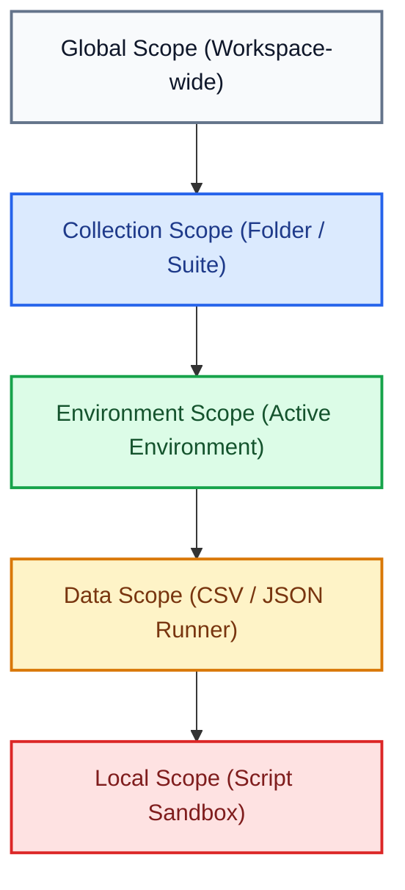
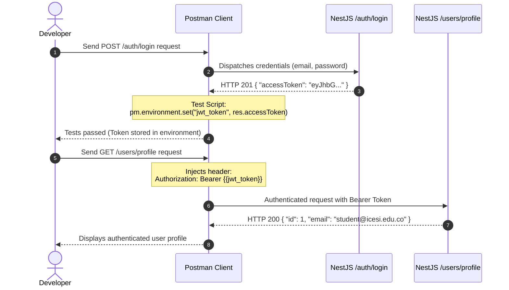

# API Testing with Postman

In modern web application development, building backend controllers and services is only half the battle. To ensure that services respond consistently, process input payloads correctly, and reject malicious or malformed requests, having a rigorous HTTP endpoint testing and validation strategy is indispensable.

**Postman** is the industry-standard platform for designing, testing, documenting, and automating HTTP APIs. It allows backend developers to simulate client requests, inspect responses in real time, chain authentication flows using environment variables, and automate test suites before deploying to production.

---

## 1. Core Concepts and Theoretical Foundations

### Why Use Postman Instead of CLI Tools?

While command-line tools like `curl` or lightweight extensions can dispatch basic HTTP requests, Postman provides a complete architecture for the API development lifecycle:

- **Structured Visual Inspection**: Automatic formatting of JSON payloads, HTTP header inspection, response latency analysis, and transfer size measurements.
- **Modular Environment Management**: Switch configuration variables (e.g., local development URLs vs. staging/cloud servers) with a single click without manually updating URLs.
- **Reactive Request Chaining**: Dynamically capture identifiers or JWT tokens returned by an authentication endpoint (such as `/auth/login`) and automatically inject them into subsequent requests.
- **Assertion Automation**: JavaScript-based test scripts to validate HTTP status codes, JSON response schemas, and response times.
- **Full Suite Automation with Collection Runner**: Sequentially execute entire collections for regression testing and continuous validation of endpoints.

---

### Anatomy of the Postman Interface

Understanding the layout of panels and tools in Postman is critical for seamless and productive backend development.


#### Technical Breakdown of Components

1. **Environment & Variable Manager**: Located in the top right corner. Allows selecting the active environment (e.g., *Dev - NestJS (Local)*). When active, expressions in `{{variable_name}}` format resolve dynamically in any field of the request.
2. **Request Builder**:
   - **HTTP Method Selector**: Defines the semantic verb of the operation (`GET` for reading, `POST` for creation, `PUT`/`PATCH` for updates, `DELETE` for removal).
   - **URL Bar**: Target endpoint parameterized with environment variables (e.g., `{{base_url}}/api/v1/auth/login`).
   - **Body Tab (raw / JSON)**: Editor where the HTTP payload is defined before transmission to the NestJS controllers.
   - **Params, Authorization, and Headers Tabs**: Panels to configure query parameters, security credentials (Bearer Token, Basic Auth), and required HTTP headers (such as `Content-Type: application/json`).
3. **Script Tabs (Pre-request and Tests)**:
   - **Pre-request Script**: JavaScript logic executed before sending the request over the network (ideal for generating unique nonces or timestamps).
   - **Tests (Post-response)**: Synchronous JavaScript scripts executed immediately upon receiving the HTTP response from the server, enabling assertions and variable persistence.
4. **Response Inspector Panel**:
   - **Status & Performance Badges**: Displays the HTTP status code (`200 OK`, `201 Created`, `400 Bad Request`, `401 Unauthorized`), round-trip latency in milliseconds, and response size.
   - **JSON Payload Viewer**: Formatted view to inspect the response data structure.
   - **Test Results Tab**: Reports how many assertions defined in the test script passed or failed.

---

### Request Lifecycle in Postman

When you click **Send**, Postman does not merely dispatch a network packet. A strictly ordered sequential lifecycle executes within Postman's JavaScript sandbox and the backend:


#### Execution Phases

1. **Phase 1: Pre-request Script**: Postman runs a secure sandbox executing any JavaScript logic assigned to the request or collection level. Temporary variables can be set, hashes computed, or dynamic headers assigned.
2. **Phase 2: Request Compilation & Transmission**: The client resolves all double-curly variable references (`{{...}}`), formats headers, serializes the JSON body, and sends the HTTP request over the network to the server port.
3. **Phase 3: NestJS Processing Pipeline**: The backend receives the request. In a NestJS architecture, the request flows sequentially through `Middlewares`, authentication `Guards`, `Interceptors`, `ValidationPipes` (validating DTOs with `class-validator`), and finally enters the `Controller` and `Service` before interacting with TypeORM and PostgreSQL.
4. **Phase 4: Response Dispatch & Reception**: The backend returns the HTTP response with its status code (`200`, `201`, `400`, `401`, `500`), server headers, and JSON body.
5. **Phase 5: Post-response Scripts and Tests**: Postman instantly runs the test sandbox. It evaluates all `pm.test()` assertions against the status code, response time, and payload.
6. **Phase 6: Variable Persistence & Reuse**: Critical values extracted from the response (such as an `accessToken`) are stored in the environment via `pm.environment.set()`, making them immediately accessible for subsequent requests in the collection.

---

### Variable Scopes and Hierarchy

Postman organizes variables into different hierarchical scopes. When a variable name exists in multiple scopes, Postman prioritizes the most specific scope (narrowest to broadest scope):



#### Description of Each Scope

- **Global**: Accessible across all collections and workspaces. Best suited for universal constants.
- **Collection**: Defined at the root of a collection. Shared across all requests within that module.
- **Environment**: Tied to a specific deployment target (e.g., `Local`, `Staging`, `Production`). Recommended for `base_url` and session tokens.
- **Data**: Injected from external data files (`.csv` or `.json`) during batch runs in the Collection Runner.
- **Local**: Declared inside Pre-request or Test scripts (`pm.variables.set()`). Only alive during the execution of that specific request.

---

### Authentication Flow and Request Chaining

In applications secured with JSON Web Tokens (JWT), manually copying and pasting tokens across endpoints is inefficient and error-prone. Automated chaining ensures a seamless testing workflow:



#### Sequence Breakdown

1. The client sends login credentials to the public authentication endpoint in NestJS.
2. The server verifies the password using `bcrypt`, generates a signed JWT, and returns the token in the response payload.
3. The Postman test script intercepts the token and programmatically saves it to the `jwt_token` environment variable.
4. On subsequent requests to protected routes, the `Authorization: Bearer {{jwt_token}}` header resolves automatically without manual intervention.

---

## 2. Step-by-Step Practical Guide: Validating a NestJS API

In this section, we will build a complete testing workflow for a NestJS backend featuring authentication and protected resources.

<StepByStep>
  <Step number="1" title="Create Collection and Define Environment">
    The first step is organizing your requests into a collection and defining the base variables for the local development server.

    1. Open Postman and in the left sidebar select **Collections** > **Create Collection (+)**. Name it `NestJS Web API`.
    2. In the left panel, navigate to **Environments** > **Create Environment (+)**. Name it `Dev - Local`.
    3. Add the following variables:

    | Variable | Type | Initial Value | Current Value |
    | :--- | :--- | :--- | :--- |
    | `base_url` | default | `http://localhost:3000` | `http://localhost:3000` |
    | `jwt_token` | secret | *(empty)* | *(empty)* |

    :::tip[Initial Value vs. Current Value]
    The **Initial Value** field is shared when syncing with your team or committing to public repositories. The **Current Value** field is stored exclusively in your local client, protecting sensitive secrets against accidental leaks.
    :::
  </Step>

  <Step number="2" title="Create the Login Request">
    Configure the HTTP request to authenticate against the NestJS authentication controller.

    1. Inside the `NestJS Web API` collection, add a new request by clicking **Add request**.
    2. Set the following parameters:
       - **Name**: `01 - User Login`
       - **Method**: `POST`
       - **URL**: `{{base_url}}/api/v1/auth/login`
    3. Under the **Headers** tab, ensure the following header is present:
       - `Content-Type: application/json`
    4. Under the **Body** tab, choose **raw** with format **JSON**, entering the login payload:

    ```json title="request-body-login.json"
    {
      "email": "student@icesi.edu.co",
      "password": "SecurePassword123!"
    }
    ```
  </Step>

  <Step number="3" title="Configure Automated Tests and Token Capture">
    In the **Tests** tab of the login request, write assertions to validate the response code and store the `accessToken` in the active environment.

    ```javascript title="postman-tests-login.js" showLineNumbers
    // 1. Verify that the server responds with HTTP 200 or 201 (OK / Created)
    pm.test("Status code is 200 or 201", function () {
        pm.expect(pm.response.code).to.be.oneOf([200, 201]);
    });

    // 2. Validate that the response contains a valid string accessToken
    pm.test("Response body contains string accessToken", function () {
        // Parse the JSON response
        const responseData = pm.response.json();
        
        // Assert that accessToken property exists and is a non-empty string
        pm.expect(responseData).to.have.property("accessToken");
        pm.expect(responseData.accessToken).to.be.a("string").and.not.empty;

        // 3. Persist the received token into the active environment
        pm.environment.set("jwt_token", responseData.accessToken);
        console.log("JWT token stored successfully in active environment.");
    });

    // 4. Validate that latency is within acceptable limits
    pm.test("Response time is under 800ms", function () {
        pm.expect(pm.response.responseTime).to.be.below(800);
    });
    ```

    Click **Send**. In the response panel below, you should see **Test Results (3/3 PASS)** and the `jwt_token` environment variable populated with the token string.
  </Step>

  <Step number="4" title="Configure Protected Endpoint with Bearer Token">
    Now we will configure an endpoint protected by an `AuthGuard('jwt')` in NestJS, consuming the `{{jwt_token}}` variable.

    1. Add a new request to the collection:
       - **Name**: `02 - Create Protected Product`
       - **Method**: `POST`
       - **URL**: `{{base_url}}/api/v1/products`
    2. Navigate to the **Authorization** tab:
       - **Type**: `Bearer Token`
       - **Token**: `{{jwt_token}}`
    3. In the **Body** tab, select **raw** > **JSON** and supply the product data:

    ```json title="request-body-create-product.json"
    {
      "name": "27-inch Curved Monitor",
      "price": 1250000,
      "stock": 15,
      "description": "144Hz IPS panel for web interface development"
    }
    ```
    
    4. In the **Tests** tab, add assertions to validate database creation:

    ```javascript title="postman-tests-create-product.js" showLineNumbers
    // Validate REST creation status code
    pm.test("Status code is 201 Created", function () {
        pm.response.to.have.status(201);
    });

    // Validate returned schema integrity
    pm.test("Response contains an autogenerated numeric id", function () {
        const body = pm.response.json();
        pm.expect(body).to.have.property("id");
        pm.expect(body.id).to.be.a("number");
        pm.expect(body.name).to.eql("27-inch Curved Monitor");
    });
    ```
  </Step>

  <Step number="5" title="Edge Cases and Error Handling (ValidationPipe)">
    A comprehensive test suite must also validate error handling and payload rejection.

    1. Add a request with intentionally invalid data:
       - **Name**: `03 - DTO Validation Error (Negative Test)`
       - **Method**: `POST`
       - **URL**: `{{base_url}}/api/v1/products`
       - **Authorization**: `Bearer Token` with `{{jwt_token}}`
    2. Send a negative price and an empty name to trigger the NestJS `ValidationPipe`:

    ```json title="request-body-invalid.json"
    {
      "name": "",
      "price": -500,
      "stock": "invalid"
    }
    ```

    3. Set up the test script to assert that the server returns `400 Bad Request`:

    ```javascript title="postman-tests-validation-error.js" showLineNumbers
    // Validate that ValidationPipe intercepts the malformed payload
    pm.test("Server responds with HTTP 400 Bad Request", function () {
        pm.response.to.have.status(400);
    });

    pm.test("Response contains validation error messages array", function () {
        const errorResponse = pm.response.json();
        pm.expect(errorResponse).to.have.property("message");
        pm.expect(errorResponse.message).to.be.an("array");
    });
    ```
  </Step>

  <Step number="6" title="Execute Suite with Collection Runner">
    The **Collection Runner** executes all collection requests in sequence, validating overall system regression stability.

    1. In the left panel, hover over the `NestJS Web API` collection and click the three dots `...` > **Run collection**.
    2. Verify execution order:
       - `01 - User Login`
       - `02 - Create Protected Product`
       - `03 - DTO Validation Error`
    3. Make sure the `Dev - Local` environment is selected.
    4. Click **Run NestJS Web API**. Postman will execute calls in order and display a detailed test pass/fail report.
  </Step>
</StepByStep>

---

## 3. Best Practices for API Testing in Postman

When building test suites in Postman for NestJS backends, adhere to these production-grade principles:

### Built-in Dynamic Variables

To avoid unique key constraint violations in the database (e.g., trying to register a user with an email that already exists in PostgreSQL), Postman provides random data generators via `{{$...}}` syntax:

- `{{$randomEmail}}`: Generates a random, unique email address.
- `{{$randomFullName}}`: Generates a simulated full name.
- `{{$randomUUID}}`: Generates a random UUID (version 4).
- `{{$timestamp}}`: Generates the current Unix timestamp in seconds.

You can use these dynamic variables directly in request bodies:

```json title="request-body-dynamic.json"
{
  "email": "{{$randomEmail}}",
  "fullName": "{{$randomFullName}}"
}
```

### Resource Isolation and Complete CRUD Cycles

Structure collections to reflect the lifecycle of a resource:

1. **POST**: Create the resource and store its generated identifier (`pm.environment.set("productId", res.id)`).
2. **GET**: Query the resource using `{{base_url}}/api/v1/products/{{productId}}`.
3. **PATCH / PUT**: Update specific fields and assert changes.
4. **DELETE**: Tear down the resource after tests to keep the development database clean.

### Robust and Granular Assertions

A resilient test should never be limited to simply checking `200 OK`. Always validate:

- **HTTP Status Code**: `pm.response.to.have.status(200)` or `201`.
- **Response Headers**: Ensure `Content-Type` includes `application/json`.
- **Payload Schema & Types**: Verify that expected properties exist with proper data types (`string`, `number`, `array`).
- **Response Times**: Ensure queries do not exceed critical latency thresholds (e.g., `pm.expect(pm.response.responseTime).to.be.below(500)`).

:::warning[Environment Variable Security in Repositories]
Never commit real production tokens, database connection strings, or passwords into **Initial Value** fields when exporting or sharing environments. Keep sensitive secrets exclusively in **Current Value**, which stays private on your local machine.
:::

---

## Self-Assessment Quiz

<Quiz id="dedw-semana-8-postman-quiz">
  <Question title="What is the primary function of Pre-request Scripts in Postman?">
    <Option>To inspect the HTTP status code received from the backend server.</Option>
    <Option correct>To execute JavaScript code before the HTTP request is transmitted over the network to configure dynamic parameters or signatures.</Option>
    <Option>To automatically export API documentation to Swagger or OpenAPI format.</Option>
    <Option>To compile backend TypeScript code before starting the server.</Option>
  </Question>

  <Question title="At what point in the Postman lifecycle do functions declared in the Tests tab execute?">
    <Option>Before the HTTP request is serialized onto the network.</Option>
    <Option>In parallel while the NestJS server processes the database query.</Option>
    <Option correct>Immediately after the HTTP response from the server is received by the Postman client.</Option>
    <Option>Only when the HTTP response returns a 4xx or 5xx error code.</Option>
  </Question>

  <Question title="If a variable named 'base_url' exists in both Global and Environment scopes, which value does Postman prioritize when sending the request?">
    <Option>The value defined in the Global scope, because it has broader coverage across the workspace.</Option>
    <Option correct>The value defined in the Environment scope, because it has higher precedence in the scope hierarchy.</Option>
    <Option>Postman throws a naming collision error and cancels request dispatch.</Option>
    <Option>It concatenates both values separated by a slash.</Option>
  </Question>

  <Question title="What is the correct Postman JavaScript instruction to persist a token in the active environment upon receiving a response?">
    <Option>pm.variables.save(&quot;jwt_token&quot;, response.token);</Option>
    <Option correct>pm.environment.set(&quot;jwt_token&quot;, pm.response.json().accessToken);</Option>
    <Option>localStorage.setItem(&quot;jwt_token&quot;, response.token);</Option>
    <Option>pm.request.headers.add(&quot;Authorization&quot;, token);</Option>
  </Question>

  <Question title="What is the security difference between Initial Value and Current Value in Postman environment configuration?">
    <Option>Initial Value is read-only, while Current Value supports numbers and booleans.</Option>
    <Option>Initial Value is automatically deleted when closing the application.</Option>
    <Option correct>Initial Value is shared with the team when syncing collections, while Current Value resides exclusively on the local client machine.</Option>
    <Option>Current Value is automatically pushed to the GitHub repository as a public file.</Option>
  </Question>

  <Question title="How is the value of an environment variable named 'jwt_token' referenced inside the Authorization tab (Bearer Token) or in a request URL?">
    <Option>$jwt_token</Option>
    <Option>:jwt_token</Option>
    <Option correct>&#123;&#123;jwt_token&#125;&#125;</Option>
    <Option>&lt;jwt_token&gt;</Option>
  </Question>

  <Question title="What is the benefit of using built-in Postman dynamic variables like &#123;&#123;$randomEmail&#125;&#125; or &#123;&#123;$randomUUID&#125;&#125; in a request body?">
    <Option>It automatically alters the port where the NestJS server listens.</Option>
    <Option correct>It generates unique, random mock data on every run to prevent unique constraint collisions or duplicate record errors.</Option>
    <Option>It temporarily disables the NestJS ValidationPipe during local testing.</Option>
    <Option>It signs the JWT token using an asymmetric public-key algorithm in the client.</Option>
  </Question>

  <Question title="Which Postman test assertion correctly validates that the returned status code is 201 Created?">
    <Option>pm.expect(pm.status).to.equal(&quot;CREATED&quot;);</Option>
    <Option correct>pm.response.to.have.status(201);</Option>
    <Option>pm.assert.statusCode === 201;</Option>
    <Option>pm.validate.code(201);</Option>
  </Question>

  <Question title="What benefit does Postman's Collection Runner provide during API development?">
    <Option>It converts NestJS controllers into independent microservices.</Option>
    <Option>It compiles TypeScript code into production-optimized JavaScript.</Option>
    <Option correct>It batch-executes an ordered sequence of HTTP requests, automatically evaluating all associated assertions.</Option>
    <Option>It monitors CPU and RAM consumption on the PostgreSQL database server.</Option>
  </Question>

  <Question title="In an endpoint protected by AuthGuard('jwt') in NestJS, which standard HTTP header must be configured to pass valid credentials?">
    <Option>Authentication: Token &#123;&#123;jwt_token&#125;&#125;</Option>
    <Option correct>Authorization: Bearer &#123;&#123;jwt_token&#125;&#125;</Option>
    <Option>X-JWT-Credential: &#123;&#123;jwt_token&#125;&#125;</Option>
    <Option>Content-Security: &#123;&#123;jwt_token&#125;&#125;</Option>
  </Question>
</Quiz>

---

## Recommended Resources

<CardGrid cols={2}>
  <Card 
    title="Official Postman Documentation" 
    description="Comprehensive reference guide for request building, environments, variables, and collections." 
    link="https://learning.postman.com/docs/introduction/overview/" 
  />
  <Card 
    title="Postman Dynamic Variables" 
    description="Complete reference of built-in mock data generators (emails, names, UUIDs, timestamps)." 
    link="https://learning.postman.com/docs/tests-and-scripts/write-scripts/variables-list/" 
  />
  <Card 
    title="Postman Test Scripts Guide" 
    description="Syntax reference for Chai.js assertions, JSON schema validations, and response handling." 
    link="https://learning.postman.com/docs/tests-and-scripts/write-scripts/test-scripts/" 
  />
  <Card 
    title="Postman Learning Center on YouTube" 
    description="Video tutorials on test automation, collection runner workflows, and industry best practices." 
    link="https://www.youtube.com/@postman" 
  />
</CardGrid>
